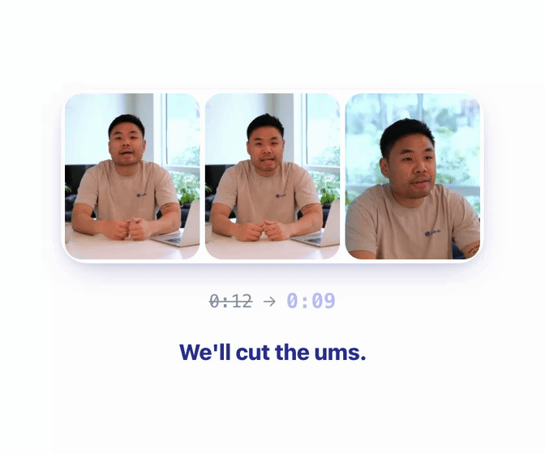

<div align="center">

# Jupitrr Cut

**Record the video. Skip the edit. Get a Reel**

A recorder with a teleprompter that auto-removes silence. Get your finished talking-head video INSTANTLY.

[](LICENSE)
[](https://github.com/Jupitrr-ai/JupitrrCut/actions/workflows/android-debug.yml)
[](https://github.com/Jupitrr-ai/JupitrrCut/releases)

<a href="https://apps.apple.com/app/line-by-line-teleprompter/id6758755243"></a>
&nbsp;
<a href="https://play.google.com/store/apps/details?id=com.jupitrr.aiteleprompter"></a>

[Android APK](https://github.com/Jupitrr-ai/JupitrrCut/releases) · no store required



</div>

## Why Jupitrr Cut

- **Finished video, not footage.** Read the script, look at the lens, export a talking-head Reel. No timeline.
- **Teleprompter and camera are one thing.** Record section by section. Retake one line. Stay on the lens. Don't memorize.
- **Pauses are already gone.** Silence out, takes stitched, before you export.
- **Editing is the next job, not this one.** Captions and B-roll live in Jupitrr AI if you want them. The talking-head is already done.
- **On-device, GPL-3.0.** The recorder can't quietly disappear behind a paywall.

## How it works

1. Paste the script.
2. Look at the camera. Record section by section. Retake any line.
3. Silence comes out. Takes stitch.
4. You have a Reel. Finished video, not footage.
5. Optional (store build): Open in Jupitrr AI.

## Quick start

**Android — APK (primary):** the latest build is on [GitHub Releases](https://github.com/Jupitrr-ai/JupitrrCut/releases). No F-Droid submission.

**Build from source:**

```bash
bun install
cp .env.example .env.development   # optional — guest mode needs nothing
bun run start
```

Press `a` for Android, `i` for iOS, or scan the QR code with a dev client.

Native Android (`./gradlew assembleDebug`) needs a debug keystore at `android/app/debug.keystore`. Android Studio creates one the first time you open the project. From the CLI:

```bash
keytool -genkeypair -v -keystore android/app/debug.keystore \
  -storepass android -keypass android -alias androiddebugkey \
  -keyalg RSA -keysize 2048 -validity 10000 \
  -dname "CN=Android Debug,O=Android,C=US"
```

iOS builds from source. There is no sideload channel. Xcode notes: [`ios/`](ios/).

### Free vs convenience

|  | Android | iOS |
|---|---|---|
| **Free, full recorder** | APK on every release · Build from source | Build from source |
| **Convenience + Jupitrr AI sync** | [Google Play](https://play.google.com/store/apps/details?id=com.jupitrr.aiteleprompter) (signed, auto-updates) | [App Store](https://apps.apple.com/app/line-by-line-teleprompter/id6758755243) (one-tap, auto-updates) |

The APK is the full recorder. Store builds add signed delivery, auto-updates, and Jupitrr AI sync. They are not a "full version."

## Architecture

This is what you're actually forking: a React Native / Expo client. Recording, silence removal, and export all run on device — start here if you're orienting yourself in the codebase.

- `app/` — Expo Router screens: `(onboarding)`, `(main)`, `(main)/projects/[id]`
- `lib/database/` — local SQLite (projects, clips, settings)
- `lib/repositories/` — data access over SQLite
- `modules/video-export/` — native Expo module (AVFoundation on iOS)

The Jupitrr AI backend is not in this repo, so you won't find it by grepping — don't go looking. This build is guest-first: the recorder works with no account. In-app purchases go through RevenueCat on store builds. Sentry and PostHog are opt-in, off by default — bring your own keys if you want them.

## Known issues / roadmap

Things that are known and open, not things you need to discover the hard way:

- iOS builds from source but isn't CI-verified — no macOS runner wired up yet. If you can get that working, it's a welcome PR.
- Not every screen has had a design-system pass — if you find a screen using raw Tailwind colors instead of the tokens in `DESIGN.md`, that's a clean first PR.

Hit something not listed here? [Open an issue](https://github.com/Jupitrr-ai/JupitrrCut/issues/new/choose) rather than working around it silently — that's how this list stays honest.

## FAQ

**Is this a video editor?**
No. Skip the editor. Cut records a finished talking-head video — not footage you still have to edit.

**Do I need a Jupitrr account?**
No. Open the app, record, export. Jupitrr AI sync (store builds) activates when you sign in.

**Is the GitHub APK the same as Play?**
Same recorder, different `applicationId`, so they can sit side by side. Store adds delivery + Jupitrr AI sync. See [Free vs convenience](#free-vs-convenience).

**Will this be on F-Droid?**
No. GitHub Releases is the APK.

**Why GPL-3.0, not MIT?**
So a fork can't be quietly closed. The recorder stays open. The Jupitrr AI backend stays closed.

**Where are the AI features?**
Not in this repo. Models and backend are Jupitrr AI. The client talks to them with an account, on the store build.

## Contributing

See [CONTRIBUTING.md](CONTRIBUTING.md). Small first PR: add a teleprompter font.

```bash
bun run check-all   # format:check + typecheck + lint — run before a PR
bun run test
bun run test <path>
bun run lint:fix
bun run format
```

Tests sit next to the file (`Component.tsx` → `Component.test.tsx`).

## Signing

Tagged releases (`v*`) and manual `release.yml` runs build a signed release APK using a real keystore held in GitHub Actions secrets, and attach it to the GitHub Release — that's what you download and install. PR/branch CI (`android-debug.yml`) only builds debug-signed APKs, fine for testing but not for distribution. The release keystore stays with Jupitrr and is never committed; a local `assembleRelease` without those secrets falls back to debug signing, so don't hand that out as an official build.

## Contributors

**Core team** — people who've shipped 5+ commits.

<table>
<tr>
<td align="center"><a href="https://github.com/tsejerome"><br><sub><b>Jerome Tse</b></sub></a></td>
<td align="center"><a href="https://github.com/VirenMohindra"><br><sub><b>Viren Mohindra</b></sub></a></td>
<td align="center"><a href="https://github.com/Rangeeshar"><br><sub><b>Rangeesh</b></sub></a></td>
</tr>
</table>

Fix something, add a teleprompter font, ship a feature — [open a PR](CONTRIBUTING.md). Land five and your face joins the core team above.

## Community

- [X — @jupitrr_ai](https://twitter.com/jupitrr_ai)
- Bugs: [open an issue](https://github.com/Jupitrr-ai/JupitrrCut/issues/new/choose)
- Everything else: [hello@jupitrr.com](mailto:hello@jupitrr.com)

## License

Jupitrr Cut is [GPL-3.0-only](LICENSE). Fork it, ship it, keep it open. The Jupitrr AI backend stays closed; the client talks to it with an account.
